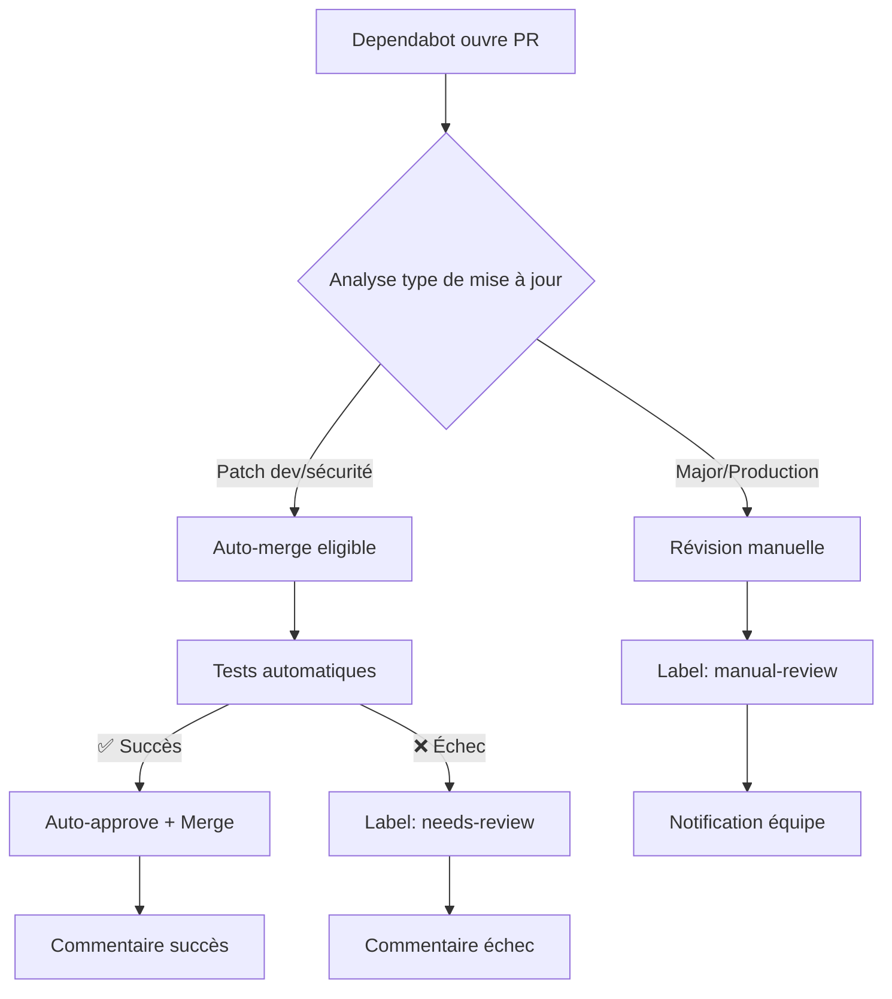

# Guide Dependabot - Gestion Automatique des Dépendances

## 📋 Vue d'ensemble

Ce projet utilise **Dependabot** pour la gestion automatique des dépendances avec des règles d'auto-merge sécurisées.

## 🔧 Configuration

### Fichiers de configuration
- `.github/dependabot.yml` - Configuration Dependabot
- `.github/workflows/dependabot-auto-merge.yml` - Automatisation des merges
- `.github/workflows/security-audit.yml` - Audit sécurité

## 📅 Planning des mises à jour

| Composant | Fréquence | Jour | Heure |
|-----------|-----------|------|-------|
| **Backend API** | Hebdomadaire | Mardi | 09:00 |
| **Frontend PWA** | Hebdomadaire | Mardi | 09:30 |
| **Root/Monorepo** | Hebdomadaire | Mardi | 10:00 |
| **Docker** | Mensuel | 1er du mois | 08:00 |
| **GitHub Actions** | Hebdomadaire | Lundi | 08:00 |

## 🤖 Règles d'Auto-merge

### ✅ Auto-merge automatique
- **Patches de dev dependencies** (`devDependencies` + `patch`)
- **Patches de sécurité** (toutes dépendances + label `security`)
- **Mises à jour mineures** de packages sûrs :
  - `@types/node`, `@types/react`
  - `eslint`, `prettier`
  - `husky`, `lint-staged`

### 🔍 Révision manuelle requise
- **Mises à jour majeures** (breaking changes potentiels)
- **Dependencies de production** (impact direct utilisateur)
- **Packages critiques** (React, NestJS, etc.)

## 🛡️ Sécurité

### Audit automatique
- **Scan hebdomadaire** des vulnérabilités
- **Création d'issues** automatique si vulnérabilités critiques
- **Dependency Review** sur toutes les PRs

### Niveaux d'alerte
| Niveau | Action | Délai |
|--------|--------|-------|
| **Critical** | Issue + assignation immédiate | < 24h |
| **High** | Issue + révision requise | < 48h |
| **Moderate** | Audit inclus dans PR | < 1 semaine |

## 📊 Workflow d'une PR Dependabot



## 🏷️ Labels utilisés

- `dependencies` - Toutes les PRs Dependabot
- `backend` / `frontend` / `monorepo` - Zone d'impact
- `auto-update` - Éligible auto-merge
- `needs-manual-review` - Révision humaine requise
- `security` - Mise à jour de sécurité
- `vulnerability` - Vulnérabilité détectée

## 📝 Commandes utiles

### Forcer une mise à jour Dependabot
```bash
# Via interface GitHub
# Aller sur: Repository → Insights → Dependency graph → Dependabot
# Cliquer "Check for updates" sur le package souhaité
```

### Vérifier manuellement les vulnérabilités
```bash
# Backend
cd apps/rncp_api
npm audit

# Frontend  
cd apps/rncp_PWA_front
npm audit

# Fix automatique (si possible)
npm audit fix
```

### Ignorer temporairement une dépendance
```yaml
# Dans .github/dependabot.yml
ignore:
  - dependency-name: "package-problématique"
    versions: ["1.x", "2.x"]
```

## 🚀 Bonnes pratiques

### Pour les développeurs

1. **Surveiller les notifications** Dependabot quotidiennement
2. **Tester localement** les mises à jour importantes
3. **Lire les changelogs** des packages mis à jour
4. **Reviewer les PRs** non auto-mergées rapidement

### Pour la maintenance

1. **Audit mensuel** des dépendances obsolètes
2. **Mise à jour** des règles d'auto-merge selon l'expérience
3. **Monitoring** des échecs d'auto-merge répétés
4. **Documentation** des packages problématiques

## 🔧 Configuration avancée

### Grouper les mises à jour
```yaml
# Dans dependabot.yml
groups:
  react-ecosystem:
    patterns:
      - "react*"
      - "@types/react*"
    exclude-patterns:
      - "react-router*"
```

### Personnaliser les messages de commit
```yaml
commit-message:
  prefix: "build"
  prefix-development: "chore"
  include: "scope"
```

## 📞 Support

### En cas de problème

1. **Vérifier les logs** GitHub Actions
2. **Consulter** l'onglet Security → Dependabot alerts
3. **Ouvrir une issue** avec le label `dependabot-issue`

### Ressources utiles

- [Documentation Dependabot](https://docs.github.com/en/code-security/dependabot)
- [Actions Dependabot](https://github.com/dependabot/fetch-metadata)
- [Sécurité npm](https://docs.npmjs.com/auditing-package-dependencies-for-security-vulnerabilities)