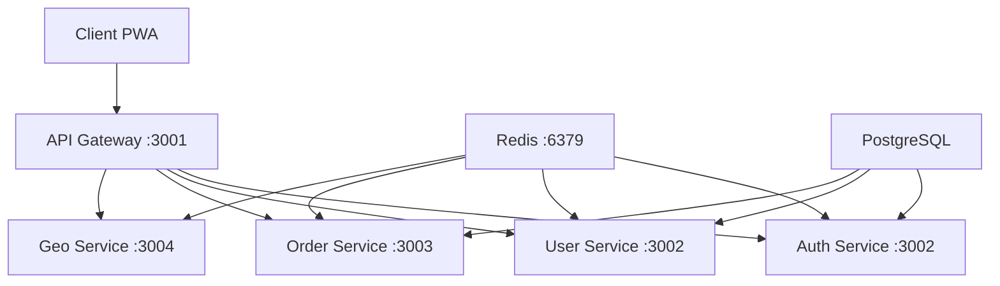

https://github.com/Fgarcia584/rncp_monorepo

# Application PWA RNCP - Monorepo

> Application Progressive Web App (PWA) développée dans le cadre de la certification RNCP Expert en Développement Logiciel

## 📋 Présentation du Projet

Cette application PWA est conçue pour la gestion de livraisons avec suivi en temps réel, développée selon une architecture microservices moderne. Le projet implémente un système complet de gestion des commandes, livraisons et tracking géographique avec capacités offline.

**Fonctionnalités principales :**
- 📱 Application Web Progressive (PWA) avec support offline
- 🚛 Gestion des livraisons et optimisation de routes
- 📍 Suivi géographique en temps réel (Leaflet/Google Maps)
- 👥 Gestion multi-rôles (Admin, Marchand, Livreur, Technicien Logistique)
- 🔐 Authentification sécurisée avec JWT
- 📊 Tableau de bord personnalisé par rôle
- 🌐 Architecture microservices avec API Gateway

**Compétences RNCP mises en œuvre :**
- **C2** - Concevoir et développer des composants d'interface utilisateur
- **C3** - Concevoir et développer la persistance des données  
- **C4** - Concevoir et développer des services applicatifs
- **C8** - Préparer et exécuter les plans de déploiement d'une application

## 🏗️ Architecture des Dossiers

```
rncp_monorepo/
├── 📁 apps/                           # Applications principales
│   ├── 📁 rncp_PWA_front/            # Frontend PWA React
│   │   ├── 📁 src/
│   │   │   ├── 📁 components/         # Composants React réutilisables
│   │   │   │   ├── 📁 auth/          # Composants d'authentification
│   │   │   │   ├── 📁 delivery/      # Composants de livraison
│   │   │   │   ├── 📁 map/           # Composants cartographiques
│   │   │   │   └── 📁 forms/         # Formulaires
│   │   │   ├── 📁 pages/             # Pages de l'application
│   │   │   ├── 📁 hooks/             # Hooks React personnalisés
│   │   │   ├── 📁 store/             # État global (Redux Toolkit)
│   │   │   │   ├── 📁 api/           # API endpoints (RTK Query)
│   │   │   │   └── 📁 slices/        # Redux slices
│   │   │   ├── 📁 types/             # Types TypeScript
│   │   │   └── 📁 utils/             # Utilitaires frontend
│   │   ├── 📄 package.json           # Dépendances frontend
│   │   └── 📄 vite.config.ts         # Configuration Vite
│   │
│   └── 📁 rncp_api/                  # Backend API NestJS
│       ├── 📁 src/
│       │   ├── 📁 microservices/     # Services métiers
│       │   │   ├── 📁 auth-service/  # Service d'authentification
│       │   │   ├── 📁 user-service/  # Service utilisateurs
│       │   │   ├── 📁 order-service/ # Service commandes
│       │   │   └── 📁 geo-service/   # Service géolocalisation
│       │   ├── 📁 gateway/           # API Gateway (proxy)
│       │   ├── 📁 entities/          # Entités TypeORM
│       │   ├── 📁 common/            # Modules partagés
│       │   │   ├── 📁 guards/        # Guards NestJS
│       │   │   ├── 📁 filters/       # Filtres d'exception
│       │   │   └── 📁 validators/    # Validateurs métiers
│       │   ├── 📁 migrations/        # Migrations base de données
│       │   └── 📁 types/             # Types TypeScript partagés
│       └── 📄 package.json           # Dépendances backend
│
├── 📁 tools/                         # Types partagés monorepo
│   └── 📁 types/                     # Définitions TypeScript communes
│
├── 📁 docs/                          # Documentation projet
│   ├── 📄 cahier-de-recettes.md     # Tests d'acceptation
│   └── 📄 integration-continue.md    # CI/CD documentation
│
├── 📄 docker-compose.yml             # Orchestration conteneurs
├── 📄 package.json                   # Configuration monorepo
├── 📄 pnpm-workspace.yaml           # Configuration workspace pnpm
└── 📄 railway.toml                   # Configuration déploiement
```

## 🛠️ Stack Technique

### **Frontend PWA**
| Technologie | Version | Usage |
|-------------|---------|-------|
| **React** | 19.0.0 | Framework UI principal |
| **TypeScript** | ^5.6.3 | Typage statique |
| **Vite** | ^6.0.3 | Build tool et dev server |
| **Redux Toolkit** | ^2.5.0 | Gestion d'état global |
| **RTK Query** | Intégré | API data fetching |
| **Tailwind CSS** | ^4.1.11 | Framework CSS utilitaire |
| **Leaflet** | ^1.9.4 | Cartographie interactive |
| **Google Maps API** | ^1.16.10 | Services géographiques |
| **Sentry** | ^10.5.0 | Monitoring erreurs |
| **Vitest** | ^2.1.6 | Framework de tests |

### **Backend API**
| Technologie | Version | Usage |
|-------------|---------|-------|
| **NestJS** | ^10.4.13 | Framework backend Node.js |
| **TypeScript** | ^5.6.3 | Typage statique serveur |
| **TypeORM** | ^0.3.20 | ORM base de données |
| **PostgreSQL** | - | Base de données relationnelle |
| **Redis** | - | Message broker microservices |
| **JWT** | ^10.2.0 | Authentification tokens |
| **bcrypt** | ^5.1.1 | Hashage mots de passe |
| **class-validator** | ^0.14.1 | Validation DTOs |
| **Sentry** | ^8.45.1 | Monitoring backend |
| **Jest** | ^29.7.0 | Tests unitaires |

### **Infrastructure & DevOps**
| Technologie | Usage |
|-------------|-------|
| **Docker** | Conteneurisation applications |
| **Docker Compose** | Orchestration développement |
| **Railway** | Plateforme de déploiement |
| **pnpm** | Gestionnaire dépendances monorepo |
| **ESLint** | Linting code |
| **Prettier** | Formatage code |
| **Husky** | Git hooks |
| **Commitlint** | Convention commits |

### **Architecture Microservices**


## 🚀 Démarrage Rapide

### Prérequis
- Node.js 18+
- pnpm 8+
- Docker (optionnel)
- PostgreSQL (ou Docker)

### Installation
```bash
# Cloner le projet
git clone <repository-url>
cd rncp_monorepo

# Installer les dépendances
pnpm install

# Configuration environnement
cp apps/rncp_api/.env.example apps/rncp_api/.env
# Éditer les variables d'environnement
```

### Développement

#### Mode Microservices (Recommandé)
```bash
# Démarrer tous les microservices + frontend
pnpm run dev:all-micro

# Ou séparément :
pnpm run dev:microservices  # Tous les microservices API
pnpm run dev:front          # Frontend uniquement
```

#### Services individuels
```bash
# Frontend PWA
cd apps/rncp_PWA_front
pnpm dev  # http://localhost:3000

# API Gateway
cd apps/rncp_api  
pnpm run dev:gateway  # http://localhost:3001

# Services métiers
pnpm run dev:auth     # Port 3002
pnpm run dev:users    # Port 3002  
pnpm run dev:orders   # Port 3003
pnpm run dev:geo      # Port 3004
```

### Tests
```bash
# Tests backend
pnpm run test
pnpm run test:cov

# Tests frontend
cd apps/rncp_PWA_front
pnpm test
```

### Build & Déploiement
```bash
# Build complet
pnpm run build

# Déploiement Railway (depuis les dossiers d'app)
cd apps/rncp_PWA_front
railway deploy

cd ../rncp_api
railway deploy
```

## 🔧 Scripts Disponibles

| Commande | Description |
|----------|-------------|
| `pnpm run dev` | Développement complet (front + API) |
| `pnpm run dev:all-micro` | Frontend + microservices API |
| `pnpm run build` | Build de production |
| `pnpm run test` | Tests unitaires backend |
| `pnpm run lint` | Linting du monorepo |
| `pnpm run format` | Formatage du code |

## 📊 Monitoring & Qualité

- **Monitoring** : Sentry (frontend + backend)
- **Health Checks** : Endpoints `/health` sur chaque service
- **Tests** : Jest (backend), Vitest (frontend)
- **Qualité** : ESLint, Prettier, Husky
- **Types** : TypeScript strict avec types partagés

## 🚢 Déploiement

L'application est déployée sur **Railway** avec :
- Frontend PWA : Build statique + nginx
- API Gateway + Microservices : Conteneurs Node.js
- Base de données : PostgreSQL Railway
- Monitoring : Sentry intégré

---

**Développé dans le cadre de la certification RNCP Expert en Développement Logiciel**
