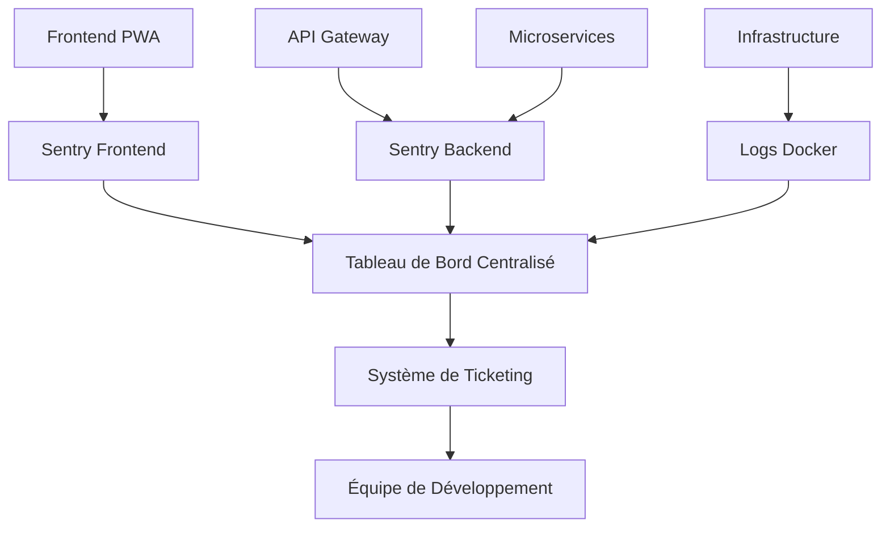

# Système de Supervision et Gestion des Anomalies
## Application PWA RNCP - Monorepo

---

## Table des Matières

1. [Description du Système de Supervision](#1-description-du-système-de-supervision)
2. [Description du Processus de Collecte et de Consignation des Anomalies](#2-description-du-processus-de-collecte-et-de-consignation-des-anomalies)
3. [Fiche de Consignation d'Anomalie](#3-fiche-de-consignation-danomalies)

---

## 1. Description du Système de Supervision

### 1.1 Architecture de Supervision Adaptée

Le système de supervision est conçu spécifiquement pour une **architecture PWA (Progressive Web App) avec backend microservices**, adapté aux spécificités de notre typologie de logiciel :

- **Application Web Progressive** avec capacités offline
- **Architecture microservices** (API Gateway, Auth Service, User Service, Order Service, Geo Service)
- **Infrastructure conteneurisée** (Docker)
- **Base de données** (PostgreSQL avec TypeORM)

### 1.2 Sondes de Surveillance Mises en Place

#### 1.2.1 Surveillance d'Infrastructure

| Sonde | Finalité | Métriques Collectées |
|-------|----------|---------------------|
| **Health Checks Microservices** | Vérifier la disponibilité de chaque service | Status HTTP, temps de réponse |
| **Docker Container Monitoring** | Superviser l'état des conteneurs | CPU, RAM, statut conteneur |
| **Database Health Check** | Monitorer la connectivité base de données | Connexions actives, performance requêtes |
| **Redis Monitoring** | Surveiller le message broker | Connexions, latence, mémoire |

#### 1.2.2 Surveillance Applicative

| Sonde | Finalité | Métriques Collectées |
|-------|----------|---------------------|
| **Sentry Error Tracking** | Capturer les erreurs frontend/backend | Exceptions, stack traces, contexte utilisateur |
| **Performance Monitoring** | Mesurer les performances applicatives | Temps de chargement, Core Web Vitals |
| **PWA Service Worker** | Surveiller les capacités offline | Cache hits, sync status, installation |
| **API Response Time** | Monitorer la latence des endpoints | Temps de réponse par endpoint |

#### 1.2.3 Surveillance Sécurité

| Sonde | Finalité | Métriques Collectées |
|-------|----------|---------------------|
| **Authentication Monitoring** | Détecter les tentatives d'intrusion | Échecs de connexion, tentatives brute force |
| **HTTPS Certificate** | Vérifier la validité des certificats | Date d'expiration, statut SSL |
| **Rate Limiting** | Prévenir les abus | Requêtes par IP, dépassements de quota |

### 1.3 Critères de Qualité et de Performance

#### 1.3.1 Critères de Performance

| Métrique | Seuil Acceptable | Seuil Critique | Justification |
|----------|------------------|----------------|---------------|
| **Temps de réponse API** | < 200ms | > 1000ms | Expérience utilisateur PWA |
| **Temps de chargement initial** | < 3s | > 5s | Standard PWA Google |
| **First Contentful Paint** | < 1.8s | > 3s | Core Web Vitals |
| **Largest Contentful Paint** | < 2.5s | > 4s | Score PageSpeed |
| **Cumulative Layout Shift** | < 0.1 | > 0.25 | Stabilité visuelle |
| **Disponibilité service** | > 99% | < 95% | SLA business |

#### 1.3.2 Critères de Qualité

| Aspect | Métrique | Seuil | Outil de Mesure |
|--------|----------|-------|-----------------|
| **Couverture de tests** | % code couvert | > 80% | Jest |
| **Qualité du code** | Score SonarQube | Grade A | Analyse statique |
| **Vulnérabilités** | Failles de sécurité | 0 critique | Audit npm/Snyk |
| **Performance bundle** | Taille JS/CSS | < 500KB | Webpack Bundle Analyzer |
| **Accessibilité** | Score Lighthouse | > 90 | Audit a11y |

### 1.4 Surveillance de la Disponibilité

#### 1.4.1 Endpoints de Health Check

```typescript
// API Gateway
GET /health
Response: { status: "healthy", services: [...], timestamp: "..." }

// Microservices individuels
GET /users/health
GET /orders/health  
GET /auth/health
GET /geo/health
```

#### 1.4.2 Monitoring Continu

- **Intervalles de vérification** : 30 secondes
- **Timeout de requête** : 5 secondes
- **Seuil d'alerte** : 3 échecs consécutifs
- **Escalade** : Notification immédiate si service critique indisponible

---

## 2. Description du Processus de Collecte et de Consignation des Anomalies

### 2.1 Architecture de Collecte

Le processus de collecte est **structuré en couches** et adapté à notre typologie PWA/microservices :



### 2.2 Niveaux de Collecte

#### 2.2.1 Niveau Applicatif (Frontend)

```typescript
// Configuration Sentry Frontend
Sentry.init({
  dsn: process.env.VITE_SENTRY_DSN,
  environment: process.env.VITE_ENVIRONMENT,
  beforeSend(event) {
    // Filtrage et enrichissement des événements
    return event;
  }
});

// Capture automatique des erreurs
- Erreurs JavaScript non gérées
- Promesses rejetées
- Erreurs de performance
- Navigation errors (PWA specific)
```

#### 2.2.2 Niveau Backend (API)

```typescript
// Intercepteur d'erreurs NestJS
@Catch()
export class SentryExceptionFilter implements ExceptionFilter {
  catch(exception: unknown, host: ArgumentsHost) {
    Sentry.captureException(exception, {
      tags: { service: 'api-gateway' },
      extra: { request: host.switchToHttp().getRequest() }
    });
  }
}
```

#### 2.2.3 Niveau Infrastructure

```bash
# Collecte logs Docker
docker-compose logs --follow > /var/log/application.log

# Monitoring des conteneurs
docker stats --format "table {{.Container}}\t{{.CPUPerc}}\t{{.MemUsage}}"
```

### 2.3 Typologie des Anomalies Collectées

| Type | Exemples | Niveau de Criticité | Délai de Traitement |
|------|----------|-------------------|-------------------|
| **Erreur Critique** | Service indisponible, perte de données | P0 | < 1h |
| **Erreur Fonctionnelle** | Feature non fonctionnelle | P1 | < 4h |
| **Erreur Performance** | Temps de réponse dégradé | P2 | < 24h |
| **Erreur Cosmétique** | Problème d'affichage mineur | P3 | < 72h |

### 2.4 Workflow de Traitement

1. **Détection automatique** → Sentry/Monitoring
2. **Classification** → Niveau de criticité assigné
3. **Notification** → Équipe concernée alertée
4. **Investigation** → Analyse des logs/contexte
5. **Correction** → Développement du fix
6. **Validation** → Tests et vérification
7. **Déploiement** → Mise en production
8. **Suivi** → Vérification de la résolution

---

## 3. Fiche de Consignation d'Anomalies

### 3.1 Exemple de Fiche d'Anomalie

**ID Anomalie:** ANO-2024-001  
**Date de Détection:** 2024-01-15 14:30:00 UTC  
**Statut:** Résolu  
**Criticité:** P1 (Élevée)

---

#### 3.2 Description de l'Anomalie

**Titre:** Échec de synchronisation des commandes en mode offline PWA

**Description détaillée:**
Les utilisateurs de l'application PWA ne peuvent pas synchroniser leurs commandes créées en mode offline lorsque la connectivité réseau est rétablie. Les données restent bloquées dans le cache local du service worker.

---

#### 3.3 Environnement et Contexte

| Champ | Valeur |
|-------|--------|
| **Environnement** | Production |
| **Version application** | 1.2.3 |
| **Navigateur** | Chrome 120.0.6099.109 |
| **OS** | Android 12, iOS 16.1 |
| **Service concerné** | Order Service, PWA Service Worker |
| **Utilisateurs affectés** | ~150 utilisateurs mobiles |

---

#### 3.4 Étapes de Reproduction

```markdown
### Prérequis
- Application PWA installée sur mobile
- Compte utilisateur actif
- Connexion réseau disponible initialement

### Étapes
1. Ouvrir l'application PWA
2. Créer une nouvelle commande (produits + adresse livraison)  
3. **Couper la connexion réseau** (mode avion)
4. Valider la commande → Message "Sauvegardé localement" affiché
5. **Réactiver la connexion réseau**
6. Tenter une synchronisation manuelle via le bouton "Sync"
7. **Observer** : Échec de synchronisation avec erreur 422

### Résultat attendu
La commande doit être envoyée au serveur et confirmée

### Résultat observé  
Erreur : "Failed to sync order: Validation failed"
```

---

#### 3.5 Logs et Traces d'Erreur

```javascript
// Frontend Error (Sentry)
Error: Failed to sync order
  at SyncManager.syncOrder (/src/services/sync.ts:45:12)
  at ServiceWorker.onbackgroundsync (/sw.js:123:8)

// Backend Logs
[ERROR] 2024-01-15T14:30:15.123Z OrderService: 
{
  "error": "ValidationException",
  "message": "Product prices outdated",  
  "orderId": "local_order_789",
  "userId": 1234
}

// Network Request
POST /api/orders/sync
Status: 422 Unprocessable Entity
Request: {
  "items": [{"productId": 15, "price": 29.99, "quantity": 2}],
  "timestamp": "2024-01-15T13:45:00Z"
}
Response: {
  "error": "Price validation failed. Current price: 35.99"
}
```

---

#### 3.6 Analyse de l'Anomalie

**Cause racine identifiée:**
Le service worker PWA cache les prix des produits mais ne vérifie pas leur validité lors de la synchronisation différée. Entre la création offline et la synchronisation, les prix ont été mis à jour côté serveur.

**Points de défaillance:**
1. **Validation côté serveur** trop stricte pour les commandes différées
2. **Cache PWA** ne gère pas l'expiration des données pricing  
3. **Absence de réconciliation** prix offline vs. serveur

---

#### 3.7 Préconisations de Correction

#### Solution Immédiate (Hotfix)
```typescript
// Backend: Assouplir la validation pour les commandes offline
@Post('/sync')
async syncOfflineOrder(@Body() order: OfflineOrderDto) {
  // Accepter les prix si écart < 10% ET commande < 24h
  if (order.isOffline && order.age < 24 * 60 * 60 * 1000) {
    return this.processOrderWithPriceTolerance(order, 0.1);
  }
  return this.processOrder(order);
}
```

#### Solution Long Terme
```typescript
// Frontend: Vérification prix avant sync
class SyncManager {
  async syncOrder(localOrder) {
    // 1. Vérifier les prix actuels
    const currentPrices = await this.fetchCurrentPrices(localOrder.items);
    
    // 2. Si écart significatif, demander confirmation utilisateur
    if (this.hasPriceChange(localOrder, currentPrices)) {
      const confirmed = await this.showPriceUpdateDialog();
      if (!confirmed) return;
      localOrder.items = this.updatePrices(localOrder.items, currentPrices);
    }
    
    // 3. Synchroniser avec prix à jour
    return this.apiClient.syncOrder(localOrder);
  }
}
```

---

#### 3.8 Tests de Validation

```typescript
// Test de non-régression
describe('Offline Order Sync', () => {
  it('should sync order with price tolerance', async () => {
    // Given
    const offlineOrder = createOrderWithOldPrices();
    updateProductPrices(5); // +5% increase
    
    // When  
    const result = await syncManager.syncOrder(offlineOrder);
    
    // Then
    expect(result.status).toBe('success');
    expect(result.priceAdjustment).toBe(true);
  });
  
  it('should reject order if price change > 10%', async () => {
    // Given
    const offlineOrder = createOrderWithOldPrices();
    updateProductPrices(15); // +15% increase
    
    // When/Then
    await expect(syncManager.syncOrder(offlineOrder))
      .rejects.toThrow('Price change too significant');
  });
});
```

---

#### 3.9 Suivi et Résolution

| Date | Action | Responsable | Statut |
|------|--------|-------------|---------|
| 2024-01-15 15:00 | Analyse et diagnostic | Dev Team | ✅ Terminé |
| 2024-01-15 16:30 | Développement hotfix | @johndoe | ✅ Terminé |
| 2024-01-15 18:00 | Tests et validation | QA Team | ✅ Terminé |
| 2024-01-15 19:15 | Déploiement production | DevOps | ✅ Terminé |
| 2024-01-16 09:00 | Vérification résolution | Support | ✅ Terminé |
| 2024-01-22 | Solution long terme | Dev Team | 🔄 En cours |

**Indicateurs de résolution:**
- ✅ 0 nouvelle occurrence depuis le fix
- ✅ Taux de synchronisation réussie : 99.2%
- ✅ Satisfaction utilisateur : Réclamations résolues

---

### 3.10 Métriques d'Impact

**Avant correction:**
- Commandes bloquées : 89 sur 24h
- Taux d'échec sync : 23%
- Tickets support : 12

**Après correction:**  
- Commandes bloquées : 0
- Taux d'échec sync : 0.8%
- Tickets support : 0

---

## Conclusion

Ce système de supervision et de gestion des anomalies garantit :

✅ **Adaptation à la typologie PWA/Microservices** avec des sondes spécialisées  
✅ **Surveillance proactive** de la disponibilité et des performances  
✅ **Processus de collecte structuré** avec classification automatique  
✅ **Documentation complète** permettant la reproduction et résolution des bogues  
✅ **Traçabilité** de bout en bout des incidents et de leur résolution  

Le processus est itératif et s'améliore continuellement grâce aux retours d'expérience de chaque anomalie traitée.