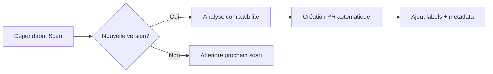

# Workflow Dependabot - Fonctionnement Détaillé

## 🔄 Vue d'ensemble du processus

Le système Dependabot automatise la gestion des dépendances avec un workflow intelligent qui combine sécurité, tests automatiques et validation avant mise à jour.

---

## 📋 Étapes du Workflow

### 1. **Détection et Création de PR**



**Fréquence** : Mardi 09:00 (backend), 09:30 (frontend), 10:00 (root)

**Métadonnées collectées** :

- Type de mise à jour (patch/minor/major)
- Dependency type (production/development)
- Package ecosystem (npm/docker/github-actions)
- Security alert (si applicable)

---

### 2. **Validation et Classification**

```yaml
# Règles de classification automatique
Auto-merge ✅:
    - Patches développement (devDependencies + semver-patch)
    - Patches sécurité (toutes deps + label security)
    - Mineures packages sûrs (@types/*, eslint, prettier, husky)

Révision manuelle 🔍:
    - Mises à jour majeures (breaking changes)
    - Dependencies production critiques
    - Packages avec historique de problèmes
```

**Sortie** :

- `should-automerge: true/false`
- `pr-type: dev-patch|security-patch|safe-minor|manual`

---

### 3. **Tests Automatiques**

```bash
# Pour chaque app (rncp_api, rncp_PWA_front)
1. Installation dépendances: pnpm install --frozen-lockfile
2. Lint: pnpm run lint
3. Tests: pnpm run test (si configuré)
4. Build: pnpm run build
```

**Critères de succès** :

- ✅ Tous les tests passent
- ✅ Build réussit sans erreur
- ✅ Lint sans violation

**En cas d'échec** :

- ❌ Blocage auto-merge
- 🏷️ Ajout label `needs-manual-review`
- 💬 Commentaire explicatif

---

### 4. **Auto-merge Conditionnel**

```typescript
// Conditions d'auto-merge
if (github.actor === 'dependabot[bot]' && shouldAutomerge === true && allTestsPassed === true && noConflicts === true) {
    // Auto-approve + merge
    autoMerge();
} else {
    // Notification révision manuelle
    requestManualReview();
}
```

**Actions auto-merge** :

1. **Auto-approval** avec commentaire justificatif
2. **Squash merge** avec titre personnalisé
3. **Commentaire succès** avec résumé
4. **Nettoyage** labels temporaires

---

### 5. **Gestion des Cas d'Exception**

#### PR nécessitant révision manuelle

```bash
Actions:
├── Ajout label "needs-manual-review"
├── Notification @Fgarcia584
├── Commentaire explicatif
└── Attente intervention humaine
```

#### Échec des tests

```bash
Actions:
├── Blocage auto-merge
├── Conservation de la PR (pas de fermeture)
├── Logs détaillés des erreurs
└── Notification équipe développement
```

#### Vulnérabilité de sécurité

```bash
Actions:
├── Création issue dédiée
├── Label "security" + "critical"
├── Assignation @Fgarcia584
└── Priorité haute (< 24h)
```

---

## 🔍 Audit Sécurité Parallèle

### Déclencheurs

- **Automatique** : Lundi 09:00 (audit hebdomadaire)
- **Manuel** : `workflow_dispatch`
- **PR** : Sur toutes les PRs Dependabot

### Processus d'audit

```bash
# Pour chaque app
npm audit --audit-level=moderate --json
│
├── Critical > 0 → Création issue + alerte
├── High > 0 → Échec workflow + révision
└── Moderate → Information dans PR
```

### Réponse aux vulnérabilités

| Niveau       | Action Immédiate    | Délai       | Notification   |
| ------------ | ------------------- | ----------- | -------------- |
| **Critical** | Issue + assignation | < 4h        | Email + Slack  |
| **High**     | Blocage merge       | < 24h       | GitHub mention |
| **Moderate** | Commentaire PR      | < 1 semaine | Dashboard      |

---

## 📊 Métriques et Monitoring

### KPIs trackés

- **Taux d'auto-merge** : % PRs mergées automatiquement
- **Temps de résolution** : Délai PR → merge
- **Échecs de tests** : % builds failed
- **Vulnérabilités** : Nombre détecté/résolu

### Tableaux de bord

- **GitHub Insights** → Dependency graph → Dependabot
- **Actions** → Workflows → Statistiques d'exécution
- **Security** → Dependabot alerts → Vulnérabilités actives

---

## 🛠️ Maintenance et Optimisation

### Révision mensuelle

```bash
Checklist:
├── Analyse des PRs échouées répétitivement
├── Mise à jour règles auto-merge
├── Vérification packages non mis à jour
└── Nettoyage issues de sécurité résolues
```

### Ajustements saisonniers

- **Décembre** : Réduction fréquence (période critique)
- **Janvier** : Nettoyage grandes mises à jour accumulées
- **Été** : Audit complet et refactoring règles

---

## 🚨 Procédure d'Urgence

### En cas de vulnérabilité critique

```bash
1. Arrêt temporaire auto-merge (si nécessaire)
2. Review manuelle immédiate
3. Tests poussés en environnement staging
4. Déploiement d'urgence si validé
5. Communication équipe + stakeholders
```

### Rollback rapide

```bash
# Si problème détecté post-merge
git revert <commit-hash>
git push origin develop
# → Déclenche nouveau workflow validation
```

---

## 📝 Logs et Traçabilité

### Informations trackées

- **Timestamp** : Heure exacte de chaque action
- **Metadata** : Version before/after, type update
- **Tests** : Logs complets succès/échec
- **Décision** : Pourquoi auto-merge ou révision manuelle

### Accès aux logs

```bash
# Via GitHub Actions
Repository → Actions → Workflow run → Job details

# Via CLI GitHub (si installée)
gh run list --workflow=dependabot-auto-merge
gh run view <run-id> --log
```

---

**Ce workflow garantit une gestion proactive, sécurisée et transparente des dépendances avec intervention humaine uniquement quand nécessaire.**
